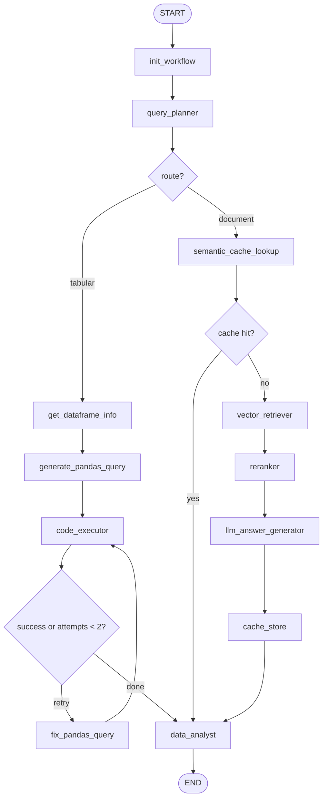

# 3-Agent Agentic RAG — Full Execution Plan

> **Stack:** LangGraph · FastAPI · OpenAI `gpt-4o-mini` · Local file storage only  
> **Last updated:** August 2026

---

## Table of Contents

1. [Overview](#1-overview)
2. [Architecture](#2-architecture)
3. [Local-First Design](#3-local-first-design)
4. [Workflow JSON / LangGraph State](#4-workflow-json--langgraph-state)
5. [Project Structure](#5-project-structure)
6. [Phase 0 — Foundation](#phase-0--foundation-days-12)
7. [Phase 1 — LangGraph State & Init](#phase-1--langgraph-state--init-day-23)
8. [Phase 2 — Build the LangGraph](#phase-2--build-the-langgraph-days-35)
9. [Phase 3 — Agent 1: Query Planner](#phase-3--agent-1-query-planner-days-57)
10. [Phase 4 — Agent 2: Code Executor](#phase-4--agent-2-code-executor-days-79)
11. [Phase 5 — Document RAG Pipeline](#phase-5--document-rag-pipeline-days-914)
12. [Phase 6 — Agent 3: Data Analyst](#phase-6--agent-3-data-analyst-days-1415)
13. [Phase 7 — FastAPI Integration](#phase-7--fastapi-integration-days-1516)
14. [Phase 8 — Jarvis Reference Mapping](#phase-8--jarvis-reference-mapping)
15. [Phase 9 — Build Sequence & Milestones](#phase-9--build-sequence--milestones)
16. [Phase 10 — Testing](#phase-10--testing)
17. [Optional Enhancements](#optional-enhancements)

---

## 1. Overview

This project implements a **3-Agent Agentic RAG** system:

| Agent | Role |
|-------|------|
| **Agent 1 — Query Planner** | Understands the question, routes to tabular or document path, generates Pandas query or retrieval query |
| **Agent 2 — Code Executor** | Executes Pandas on CSV/Excel (tabular path only); retries once on failure |
| **Agent 3 — Data Analyst** | Converts raw results into a human-friendly answer; returns friendly errors on failure |

**Document RAG path** (Cache → Retriever → Reranker → LLM) runs as LangGraph nodes between Agent 1 and Agent 3 — Agent 2 is skipped.

**Orchestration:** [LangGraph](https://langchain-ai.github.io/langgraph/) `StateGraph` — the workflow JSON is the graph state.

**No separate application backend:** FastAPI receives the request; an `init_workflow` node creates the initial state.

---

## 2. Architecture

```
User Question
     │
     ▼
FastAPI (/ask)
     │
     ▼
init_workflow  ──►  creates WorkflowState (workflow JSON)
     │
     ▼
Agent 1: Query Planner
     │
     ├─── tabular ──► get_dataframe_info() ──► generate Pandas ──► Agent 2: Code Executor ──► Agent 3
     │
     └─── document ──► Cache ──┬── hit  ──► Agent 3
                               └── miss ──► Retriever ──► Reranker ──► LLM ──► Cache Store ──► Agent 3
```

### LangGraph Flow Diagram



---

## 3. Local-First Design

All files and data stores live on the local drive. **No cloud storage is used.**

| Asset | Storage |
|-------|---------|
| CSV / Excel uploads | `data/uploads/` on local disk |
| PDF / DOCX / TXT uploads | `data/uploads/` on local disk |
| Tabular reads | `pandas.read_csv()` / `read_excel()` from local path |
| Document ingestion | Read from local path (PyMuPDF, python-docx) |
| Vector embeddings | ChromaDB persisted to `data/vector_db/` |
| Semantic cache | SQLite at `data/cache.db` |
| API keys | `.env` file (never committed) |

Jarvis reference code used GCS (`gs://` URIs). In this project, `get_dataframe_info()` and `run_query_data()` read directly from a local `file_path`.

---

## 4. Workflow JSON / LangGraph State

Every node reads and **merges** into state — agents never replace the full JSON.

### State Schema (`app/graph/state.py`)

```python
from typing import TypedDict, Optional, Literal

class WorkflowState(TypedDict):
    workflow_id: str
    status: str

    # Set once at request time
    user_question: str
    file_path: str          # local path, e.g. C:/.../data/uploads/sales.xlsx
    file_type: Literal["csv", "excel", "document"]

    # Agent 1 — merged, not replaced
    planner_output: Optional[dict]

    # Agent 2 (tabular only)
    execution_result: Optional[dict]

    # Document RAG
    retrieval_result: Optional[dict]

    # Agent 3
    analyst_output: Optional[dict]

    # Routing control flags
    route: Optional[Literal["tabular", "document"]]
    cache_hit: bool
    execution_attempts: int
    max_execution_attempts: int

    metadata: dict
```

### Full JSON Shape (for reference / debugging)

```json
{
  "workflow_id": "uuid",
  "created_at": "ISO-8601",
  "status": "pending | planning | executing | retrieving | analyzing | completed | failed",

  "input": {
    "user_question": "What is the total revenue by region?",
    "file_path": "C:/Users/.../data/uploads/sales.xlsx",
    "file_type": "excel"
  },

  "planner_output": {
    "route": "tabular | document",
    "reasoning": "why this route was chosen",
    "dataset_summary": null,
    "pandas_query": null,
    "retrieval_query": null,
    "queries": []
  },

  "execution_result": {
    "success": false,
    "attempts": 0,
    "raw_result": null,
    "error": null,
    "executed_code": null
  },

  "retrieval_result": {
    "cache_hit": false,
    "cached_answer": null,
    "retrieved_chunks": [],
    "reranked_chunks": [],
    "llm_answer": null,
    "sources": []
  },

  "analyst_output": {
    "final_answer": null,
    "error_message": null,
    "confidence": "high | medium | low"
  },

  "metadata": {
    "model": "gpt-4o-mini",
    "timings_ms": {},
    "agent_trace": []
  }
}
```

---

## 5. Project Structure

```
rag-project/
├── app/
│   ├── main.py                      # FastAPI entry
│   ├── config.py                    # paths, API keys, model name
│   ├── api/
│   │   └── routes.py                # /ask, /upload, /ingest
│   ├── graph/
│   │   ├── state.py                 # WorkflowState TypedDict
│   │   ├── workflow.py              # StateGraph definition + compile
│   │   └── nodes/
│   │       ├── init_workflow.py
│   │       ├── query_planner.py     # Agent 1
│   │       ├── code_executor.py     # Agent 2
│   │       ├── document_rag.py      # Cache → Retriever → Reranker → LLM
│   │       └── data_analyst.py      # Agent 3
│   ├── tools/
│   │   ├── dataframe_tools.py       # get_dataframe_info, run_query_data
│   │   └── document_tools.py
│   ├── rag/
│   │   ├── ingest.py
│   │   ├── retriever.py
│   │   ├── reranker.py
│   │   ├── cache.py
│   │   └── prompts.py
│   └── llm/
│       └── openai_client.py         # gpt-4o-mini wrapper
├── data/
│   ├── uploads/                     # user CSV/Excel/PDF files
│   ├── vector_db/                   # Chroma persisted embeddings
│   └── cache.db                     # SQLite semantic cache
├── .env
├── requirements.txt
├── EXECUTION_PLAN.md                # this file
└── README.md
```

---

## Phase 0 — Foundation (Days 1–2)

### 0.1 Dependencies

```
fastapi
uvicorn
langgraph
langchain-openai
langchain-core
pandas
openpyxl
pydantic
python-dotenv
chromadb
sentence-transformers       # optional: local embeddings
pymupdf                     # PDF ingestion
python-docx                 # DOCX ingestion
```

### 0.2 Environment (`.env`)

```env
OPENAI_API_KEY=sk-...
OPENAI_MODEL=gpt-4o-mini
OPENAI_EMBEDDING_MODEL=text-embedding-3-small
DATA_DIR=C:/Users/avina/Desktop/Projects/rag-project/data
UPLOAD_DIR=C:/Users/avina/Desktop/Projects/rag-project/data/uploads
VECTOR_DB_DIR=C:/Users/avina/Desktop/Projects/rag-project/data/vector_db
CACHE_DB_PATH=C:/Users/avina/Desktop/Projects/rag-project/data/cache.db
SEMANTIC_CACHE_THRESHOLD=0.92
SEMANTIC_CACHE_TTL_HOURS=24
```

### 0.3 Local File Handling

- `POST /upload` — saves file to `data/uploads/`, returns `file_path` + `file_type`
- `POST /ask` — accepts `{ "question": "...", "file_path": "..." }`
- Validate file exists on disk before starting the graph

### 0.4 File Type Detection

| Extension | `file_type` |
|-----------|-------------|
| `.csv` | `csv` |
| `.xlsx`, `.xls` | `excel` |
| `.pdf`, `.txt`, `.docx` | `document` |

---

## Phase 1 — LangGraph State & Init (Day 2–3)

### 1.1 `init_workflow` Node

Replaces the missing "Application Backend". Called as the first graph node.

```python
def init_workflow(state: WorkflowState) -> dict:
    return {
        "workflow_id": str(uuid4()),
        "status": "pending",
        "execution_attempts": 0,
        "max_execution_attempts": 2,
        "cache_hit": False,
        "planner_output": None,
        "execution_result": None,
        "retrieval_result": None,
        "analyst_output": None,
        "metadata": {"model": "gpt-4o-mini", "agent_trace": []},
    }
```

FastAPI passes `user_question`, `file_path`, and `file_type` as input state before invoking the graph.

### 1.2 OpenAI Client Wrapper

```python
async def call_llm(system_prompt: str, user_prompt: str) -> dict:
    # model = gpt-4o-mini
    # temperature = 0 for planner/executor, 0.3 for analyst
    # response_format = json_object where structured output is needed
```

---

## Phase 2 — Build the LangGraph (Days 3–5)

### 2.1 Graph Definition (`app/graph/workflow.py`)

```python
from langgraph.graph import StateGraph, END

graph = StateGraph(WorkflowState)

graph.add_node("init_workflow",       init_workflow)
graph.add_node("query_planner",       query_planner_node)
graph.add_node("inspect_dataset",     inspect_dataset_node)
graph.add_node("generate_pandas",     generate_pandas_node)
graph.add_node("code_executor",       code_executor_node)
graph.add_node("fix_pandas_query",    fix_pandas_query_node)
graph.add_node("cache_lookup",        cache_lookup_node)
graph.add_node("retriever",           retriever_node)
graph.add_node("reranker",            reranker_node)
graph.add_node("llm_answer",          llm_answer_node)
graph.add_node("cache_store",         cache_store_node)
graph.add_node("data_analyst",        data_analyst_node)

graph.set_entry_point("init_workflow")
graph.add_edge("init_workflow", "query_planner")

graph.add_conditional_edges(
    "query_planner",
    route_after_planner,
    {"tabular": "inspect_dataset", "document": "cache_lookup"},
)

graph.add_edge("inspect_dataset", "generate_pandas")
graph.add_edge("generate_pandas", "code_executor")
graph.add_conditional_edges(
    "code_executor",
    route_after_execution,
    {"retry": "fix_pandas_query", "analyze": "data_analyst"},
)
graph.add_edge("fix_pandas_query", "code_executor")

graph.add_conditional_edges(
    "cache_lookup",
    route_after_cache,
    {"hit": "data_analyst", "miss": "retriever"},
)
graph.add_edge("retriever", "reranker")
graph.add_edge("reranker", "llm_answer")
graph.add_edge("llm_answer", "cache_store")
graph.add_edge("cache_store", "data_analyst")
graph.add_edge("data_analyst", END)

rag_graph = graph.compile()
```

### 2.2 Routing Functions

```python
def route_after_planner(state):
    return state["planner_output"]["route"]   # "tabular" | "document"

def route_after_execution(state):
    if state["execution_result"]["success"]:
        return "analyze"
    if state["execution_attempts"] < state["max_execution_attempts"]:
        return "retry"
    return "analyze"   # pass error to analyst — no hallucination

def route_after_cache(state):
    return "hit" if state["cache_hit"] else "miss"
```

---

## Phase 3 — Agent 1: Query Planner (Days 5–7)

### 3.1 Node Breakdown

| Node | Responsibility |
|------|---------------|
| `query_planner_node` | LLM decides `tabular` vs `document`; generates `retrieval_query` for document path |
| `inspect_dataset_node` | Calls `get_dataframe_info(file_path)` — tabular only |
| `generate_pandas_node` | LLM generates Pandas using actual columns from `dataset_summary` |

### 3.2 Tabular Flow

1. `query_planner_node` sets `route = "tabular"`
2. `inspect_dataset_node` calls `get_dataframe_info(local_file_path)`
3. Result stored in `planner_output.dataset_summary`
4. `generate_pandas_node` generates code using real column names
5. Sets `planner_output.pandas_query` and appends to `planner_output.queries`

### 3.3 Document Flow

1. `query_planner_node` sets `route = "document"`
2. LLM rewrites user question into `planner_output.retrieval_query`
3. Graph routes to `cache_lookup` (skips inspect + executor)

### 3.4 `get_dataframe_info` (Local — adapted from Jarvis)

```python
_MAX_UNIQUE_VALUES = 50

def get_dataframe_info(file_path: str, sheet_name: str = None) -> dict:
    df = _load_local_dataframe(file_path, sheet_name)  # read_csv / read_excel
    df = _normalize_columns(df)

    unique_values = {}
    for col in df.columns:
        vals = df[col].dropna().unique().tolist()
        if len(vals) > _MAX_UNIQUE_VALUES:
            unique_values[col] = vals[:_MAX_UNIQUE_VALUES] + [
                f"[... {len(vals) - _MAX_UNIQUE_VALUES} more values truncated]"
            ]
        else:
            unique_values[col] = vals

    return {
        "status": "success",
        "shape": list(df.shape),
        "dtypes": {col: str(dtype) for col, dtype in df.dtypes.items()},
        "unique_values": unique_values,
        "sample_rows": df.head(3).to_string(),
    }
```

**Column normalization** (from Jarvis):
```python
df.columns = (
    df.columns.astype(str).str.strip()
    .str.replace(r"\s+", "_", regex=True)
    .str.replace(r"[^\w]", "_", regex=True)
)
```

### 3.5 Planner Routing Prompt

```
You are a Query Planner. Given a user question and file type, decide:
- "tabular" if the question needs filtering/aggregation on CSV/Excel data
- "document" if the question needs reading unstructured text (PDF, DOCX, TXT)

Return JSON:
{
  "route": "tabular" | "document",
  "reasoning": "...",
  "retrieval_query": "..."   // null for tabular; rewritten query for document
}
```

---

## Phase 4 — Agent 2: Code Executor (Days 7–9)

**Runs only when `route == "tabular"`.**

### 4.1 `run_query_data` (Local — adapted from Jarvis)

```python
_MAX_DATAFRAME_ROWS = 100

def run_query_data(file_path: str, query: str, sheet_name: str = None) -> dict:
    df = _load_local_dataframe(file_path, sheet_name)
    query = _strip_file_loading_lines(query)   # block read_csv/read_excel in generated code

    scope = {"df": df, "pandas": pandas, "__builtins__": __builtins__}
    lines = [l.strip() for l in query.strip().split("\n") if l.strip()]

    if len(lines) > 1:
        exec("\n".join(lines[:-1]), scope)
    last = lines[-1]
    # exec if assignment, else eval
    result = ...

    return {"status": "success", "result": _to_serializable(result)}
    # or {"status": "error", "error": str(e)}
```

**Security rules:**
- Pre-load `df` — no file I/O in generated code
- Strip any `pandas.read_csv` / `read_excel` lines from LLM output
- Truncate DataFrame results to 100 rows

### 4.2 Retry Loop (Max 2 Attempts)

| Node | Action |
|------|--------|
| `code_executor_node` | Increment `execution_attempts`, call `run_query_data`, write `execution_result` |
| `fix_pandas_query_node` | Pass error + `dataset_summary` + failed query to LLM; update `planner_output.pandas_query` |
| Conditional edge | `"retry"` if failed and `attempts < 2`; else `"analyze"` |

### 4.3 `execution_result` Shapes

**Success:**
```json
{
  "success": true,
  "attempts": 1,
  "raw_result": [{"region": "North", "revenue": 120000}],
  "executed_code": "df.groupby('region')['revenue'].sum()...",
  "error": null
}
```

**Failure (after 2 attempts):**
```json
{
  "success": false,
  "attempts": 2,
  "error": "KeyError: 'Region' — column not found",
  "raw_result": null
}
```

---

## Phase 5 — Document RAG Pipeline (Days 9–14)

Implemented as LangGraph nodes (not a separate agent).

### 5.1 Document Ingestion (`POST /ingest`)

Run once per uploaded document:

1. Load from local path
   - PDF → PyMuPDF
   - DOCX → python-docx
   - TXT → plain read
2. Chunk: 500–800 tokens, 50–100 token overlap
3. Embed with OpenAI `text-embedding-3-small` (or local `all-MiniLM-L6-v2`)
4. Store in Chroma collection scoped by `file_path`

### 5.2 Cache Node (`cache_lookup_node`)

Adapted from Jarvis semantic cache (Qdrant + Redis → local SQLite).

**SQLite schema:**
```sql
CREATE TABLE cache (
  id            TEXT PRIMARY KEY,
  file_path     TEXT NOT NULL,
  query_text    TEXT NOT NULL,
  query_embedding BLOB,
  answer        TEXT NOT NULL,
  created_at    TIMESTAMP DEFAULT CURRENT_TIMESTAMP
);
```

**Lookup logic:**
1. Embed `planner_output.retrieval_query`
2. Cosine similarity against cached embeddings for the same `file_path`
3. Score ≥ `SEMANTIC_CACHE_THRESHOLD` (0.92) → `cache_hit = True`, set `retrieval_result.cached_answer`
4. Miss → pass embedding forward (avoid re-embedding on store)

**Cache hit:** skip Retriever, Reranker, LLM → go directly to Agent 3.

### 5.3 Retriever Node

```python
async def retriever_node(state):
    results = chroma_collection.query(
        query_embeddings=[embedding],
        n_results=10,
        where={"file_path": state["file_path"]},
    )
    # store in retrieval_result.retrieved_chunks
```

### 5.4 Reranker Node

- Cross-encoder: `cross-encoder/ms-marco-MiniLM-L-6-v2` (local, free)
- Or LLM rerank with `gpt-4o-mini`
- Keep top 3–5 chunks → `retrieval_result.reranked_chunks`

### 5.5 LLM Answer Node

```
System: Answer only from the provided context. If the answer is not in the context, say "I don't know."
User:
  Context:
  {chunk_1}
  {chunk_2}
  ...
  User Query: {user_question}
```

Store: `retrieval_result.llm_answer`, `retrieval_result.sources`

### 5.6 Cache Store Node

After LLM answer, write to SQLite:
- `file_path`, `query_text`, `query_embedding`, `answer`, `created_at`
- Enforce TTL: delete entries older than `SEMANTIC_CACHE_TTL_HOURS`

---

## Phase 6 — Agent 3: Data Analyst (Days 14–15)

**`data_analyst_node`** — single LLM call.

### Input by Route

| Route | Input |
|-------|-------|
| Tabular success | `user_question` + `execution_result.raw_result` |
| Tabular failure | `user_question` + `execution_result.error` + available columns |
| Document cache hit | `user_question` + `retrieval_result.cached_answer` |
| Document cache miss | `user_question` + `retrieval_result.llm_answer` + sources |

### Rules

- Convert raw data into clear, natural language
- Highlight key numbers
- Cite sources for document answers
- **On error: return a friendly message. Never invent data.**

### Output

```json
{
  "final_answer": "North leads with $120,000 in revenue, followed by South at $95,000.",
  "error_message": null,
  "confidence": "high"
}
```

Set `status = "completed"`.

---

## Phase 7 — FastAPI Integration (Days 15–16)

```python
@app.post("/upload")
async def upload(file: UploadFile):
    path = save_to_local(UPLOAD_DIR, file)
    return {"file_path": str(path), "file_type": detect_file_type(path)}

@app.post("/ingest")
async def ingest(req: IngestRequest):
    # chunk + embed document from local file_path into Chroma
    chunks_indexed = await ingest_document(req.file_path)
    return {"file_path": req.file_path, "chunks_indexed": chunks_indexed}

@app.post("/ask")
async def ask(req: AskRequest):
    initial_state = {
        "user_question": req.question,
        "file_path": req.file_path,
        "file_type": detect_file_type(req.file_path),
    }
    final_state = await rag_graph.ainvoke(initial_state)
    return {
        "answer": final_state["analyst_output"]["final_answer"],
        "error": final_state["analyst_output"].get("error_message"),
        "workflow_id": final_state["workflow_id"],
        "route": final_state.get("route"),
    }

@app.get("/workflow/{workflow_id}")
async def get_workflow(workflow_id: str):
    # optional: return persisted state for debugging
    ...
```

---

## Phase 8 — Jarvis Reference Mapping

| Jarvis Component | Reuse | Skip / Replace |
|-----------------|-------|----------------|
| `agentic_gcs_analyze_tool` → `get_dataframe_info()` | Column normalization, unique value cap, dtypes, sample rows | GCS download → local `read_csv`/`read_excel` |
| `agentic_gcs_query_tool` → `run_query_on_gcs_data()` | Safe pandas exec, strip file-loading lines, row truncation | GCS, WIF credentials |
| `semantic cache` + `chat_completion_cache_policy` | Embed → similarity → fetch answer; return embedding on miss | Qdrant + Redis → SQLite |
| `vector store retriever` | Embed query → top-k chunks → Document objects | Qdrant → Chroma |
| `base reranker` | Rerank interface | Dexter → local cross-encoder |
| `fk retrieval qa prompt` | Context + query prompt structure | FK-GPT/Gemini → OpenAI |
| `flow processor` + `base flow` | Sequential execution idea | Replace with LangGraph nodes |
| `graph rag query service` / `graph store` | — | Skip for v1 |
| `structure data query client` | Backend-agnostic tabular interface idea | Implement as LangGraph tabular branch |

---

## Phase 9 — Build Sequence & Milestones

### Recommended Order

```
Phase 0  →  Project setup, config, local file handling
Phase 1  →  WorkflowState + init_workflow node
Phase 2  →  LangGraph skeleton (all nodes wired, stubs)
Phase 3  →  get_dataframe_info + query_planner + generate_pandas
Phase 4  →  run_query_data + code_executor + retry loop
Phase 6  →  data_analyst (tabular path complete)
Phase 7  →  FastAPI /ask (tabular MVP)
Phase 5  →  Document ingest + Chroma
Phase 5  →  cache_lookup + retriever + reranker + llm_answer + cache_store
Phase 7  →  Wire document branch; end-to-end tests
```

### Milestones

| # | Goal | Validates |
|---|------|-----------|
| M1 | Tabular `/ask` on local CSV | Planner → executor → analyst |
| M2 | Bad column name → retry → friendly error | Retry loop + analyst error handling |
| M3 | Ingest local PDF → `/ask` | Full document RAG path |
| M4 | Same question twice → cache hit | Cache skips retriever/reranker/LLM |

### Timeline Estimate

| Phase | Duration |
|-------|----------|
| 0 — Foundation | 2–3 days |
| 1 — State & init | 1 day |
| 2 — LangGraph wiring | 2–3 days |
| 3 — Query Planner | 3–4 days |
| 4 — Code Executor | 2–3 days |
| 5 — Document RAG | 4–5 days |
| 6 — Data Analyst | 1–2 days |
| 7 — FastAPI integration | 2 days |
| 10 — Testing | 2–3 days |
| **Total** | **~3–4 weeks** |

---

## Phase 10 — Testing

| Test Case | Expected Result |
|-----------|----------------|
| CSV aggregation ("total revenue by region") | Correct grouped sum |
| Wrong column name in generated query | Executor retries once; analyst returns friendly error with available columns |
| PDF Q&A (cache miss) | Retriever → reranker → LLM → answer with sources |
| Identical PDF question (cache hit) | Answer returned without retriever/reranker/LLM |
| Question outside document scope | Analyst says "not found in the document" |
| Large Excel (10k+ rows) | `get_dataframe_info` uses sampling; unique values capped at 50 |
| Upload + ask flow | File saved locally, path passed to graph |

---

## Optional Enhancements

- **LangGraph checkpointing** — `SqliteSaver` to pause/resume workflows
- **Streaming** — `astream_events()` for live agent status in UI
- **Human-in-the-loop** — `interrupt_before=["query_planner"]` for query approval
- **Tool binding** — `@tool` decorators + `ToolNode` for planner/executor
- **Subgraph** — document RAG as a nested `StateGraph`
- **Conversation memory** — `session_id` in state for multi-turn Q&A
- **CLI** — local script that calls `rag_graph.invoke()` without FastAPI
- **Hybrid queries** — Excel + attached PDF in one workflow (future)

---

## Quick Reference

| Concern | Choice |
|---------|--------|
| Orchestration | LangGraph `StateGraph` |
| State | `WorkflowState` TypedDict (= workflow JSON) |
| LLM | OpenAI `gpt-4o-mini` |
| Embeddings | OpenAI `text-embedding-3-small` or local `all-MiniLM-L6-v2` |
| Vector store | ChromaDB (local, `data/vector_db/`) |
| Cache | SQLite (local, `data/cache.db`) |
| Tabular tools | `get_dataframe_info()` + `run_query_data()` (local paths) |
| File storage | Local `data/uploads/` — no cloud |
| API | FastAPI (`/upload`, `/ingest`, `/ask`) |
| Init state | `init_workflow` node (no separate backend) |
